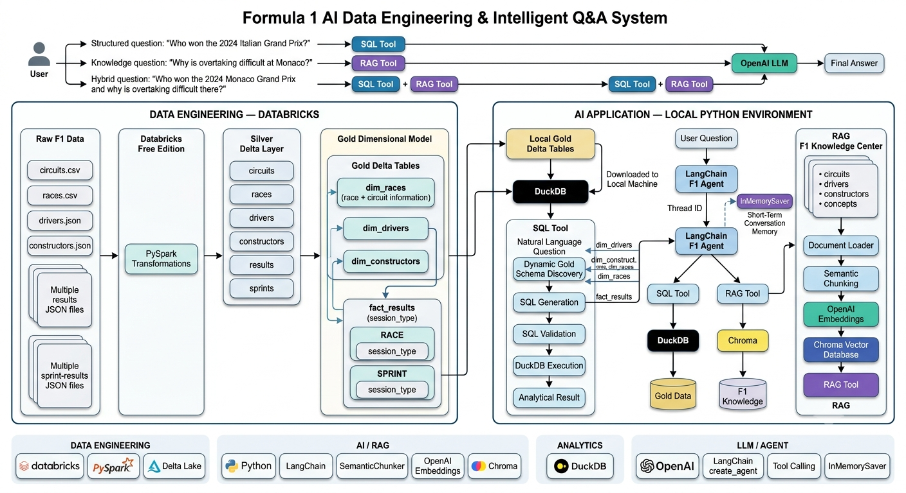

# Formula 1 AI Data Engineering & Q&A Agent

An end-to-end **AI Data Engineering project** that combines a Databricks data pipeline with **RAG, natural-language-to-SQL, tool calling, and an LLM agent** to answer Formula 1 questions.

## Architecture



## What the Project Does

The application combines two types of Formula 1 knowledge:

* **Structured data** — race results, drivers, constructors, races, points, positions, and sprint results.
* **Unstructured knowledge** — circuit information, driver profiles, constructor information, and F1 concepts.

A LangChain agent decides whether to use the **SQL tool**, **RAG tool**, or both.

## Data Engineering Pipeline

Formula 1 CSV and JSON data is processed in **Databricks** using PySpark.

```text
Raw Data
   ↓
PySpark
   ↓
Silver Delta Tables
   ↓
Gold Dimensional Model
```

### Silver Layer

The raw data is cleaned and transformed into Delta tables for:

* Circuits
* Races
* Drivers
* Constructors
* Results
* Sprint Results

### Gold Layer

The Gold model contains:

```text
dim_races
dim_drivers
dim_constructors
fact_results
```

`dim_races` combines race and circuit information.

`fact_results` contains both race and sprint results and uses `session_type` to distinguish:

```text
RACE
SPRINT
```

## SQL Analytics

Gold Delta tables are downloaded locally and queried using **DuckDB**.

The SQL tool dynamically inspects the Gold table schemas and uses OpenAI to generate SQL from natural-language questions.

```text
Natural Language Question
        ↓
Schema Discovery
        ↓
OpenAI SQL Generation
        ↓
SQL Validation
        ↓
DuckDB
        ↓
Gold Delta Data
        ↓
Result
```

Example:

> How many points did Max Verstappen score in the 2024 season?

## RAG Pipeline

The RAG knowledge base contains Markdown documents covering:

```text
knowledge_center/
├── circuits/
├── drivers/
├── constructors/
└── concepts/
```

The pipeline is:

```text
Knowledge Documents
        ↓
Document Loader
        ↓
Semantic Chunking
        ↓
OpenAI Embeddings
        ↓
Chroma Vector Database
        ↓
RAG Tool
```

Semantic chunking is used to create chunks based on semantic meaning rather than only fixed text length.

Example:

> Why is overtaking difficult at Monaco?

The RAG tool retrieves relevant Monaco information from Chroma and provides it to the LLM for a grounded response.

## AI Agent

The final application uses a **LangChain agent** with two tools:

```text
search_f1_knowledge()
query_f1_data()
```

### SQL Question

```text
Who won the 2024 Italian Grand Prix?
```

→ SQL Tool → DuckDB → Gold Data

### RAG Question

```text
Why is overtaking difficult at Monaco?
```

→ RAG Tool → Chroma → Knowledge Base

### Hybrid Question

```text
Who won the 2024 Monaco Grand Prix and why is overtaking difficult there?
```

→ SQL Tool + RAG Tool

The agent can call the available tools as needed and combine their results into one response.

## Multi-Turn Conversations

The application supports multiple questions within the same session using `InMemorySaver` and a thread ID.

Example:

```text
User: Who won the 2024 British Grand Prix?
Assistant: Lewis Hamilton.

User: Which constructor did he drive for?
Assistant: Mercedes.
```

## Technology Stack

**Data Engineering**

* Databricks
* PySpark
* Delta Lake

**AI / RAG**

* Python
* LangChain
* SemanticChunker
* OpenAI
* Chroma

**Analytics**

* DuckDB

**Agent**

* LangChain `create_agent`
* Tool Calling
* OpenAI Responses API
* InMe
